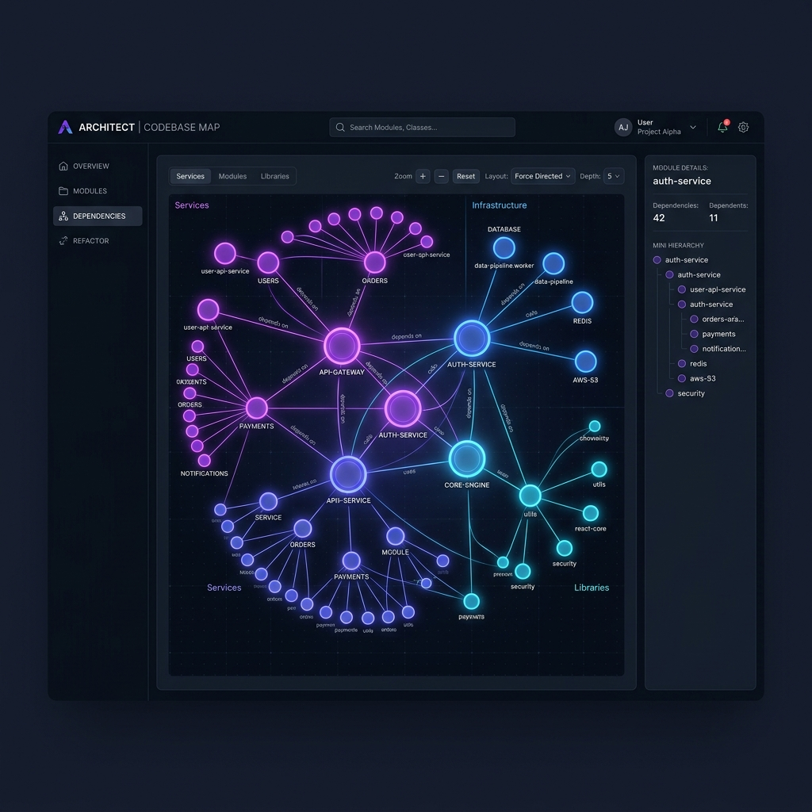
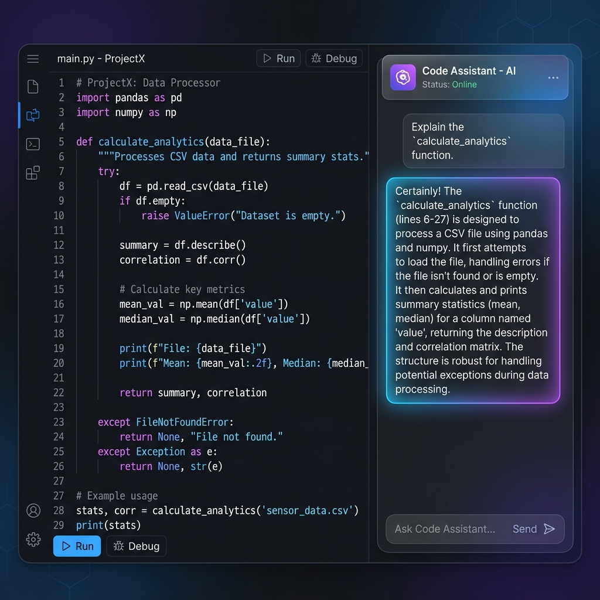
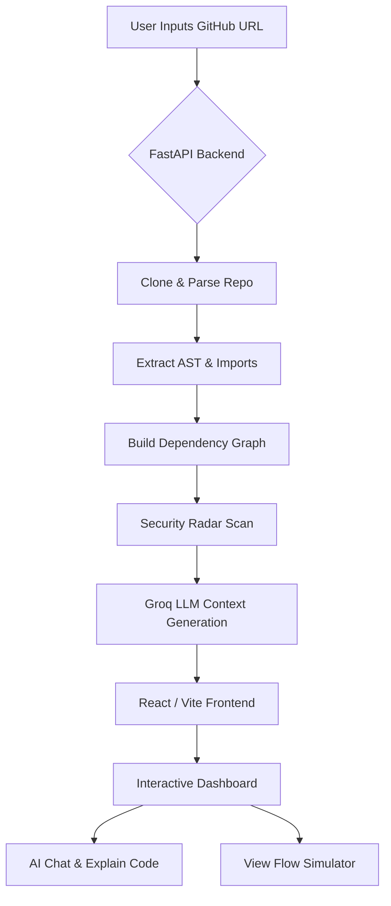

<div align="center">
  
  <h1>CodeScope AI</h1>
  <p><strong>Intelligent GitHub repository explorer</strong></p>
  <p><i>Dependency graphs, architecture hints, security scanning, and <b>Groq</b>-powered explanations in one seamless web app.</i></p>

  
  
  
</div>

<br />



CodeScope AI is a full-stack web application designed to help developers **understand unfamiliar codebases blazing fast**. By simply pasting a public GitHub repository URL, CodeScope AI clones, parses, and visualizes the repository structure, all while offering deep insights through its LLM-powered engine.

## 📸 Gallery

<p align="center">
  
</p>

## 🧩 How It Works (Workflow)



## ✨ Features

- 🌳 **Interactive File Explorer**: A beautiful, intuitive view of the repository's files.
- 🕸️ **Dependency Graphs**: Visual representations of file relationships and imports to let you understand the overarching structure.
- 🏗️ **Architecture Hints**: Heuristic detection of tech stacks, frameworks, and patterns used in the project.
- 🛡️ **Risk Radar**: Lightning-fast regex-based security scans highlighting risky patterns like exposed secrets and `eval()` usage.
- 🤖 **Groq-Powered AI**: Chat with your codebase context. Get instant file summaries ("Explain Like I'm 5"), line highlights, and architecture analysis—powered by Groq's high-speed inference.
- 📄 **README Generator**: Automatically synthesize a high-quality README tailored for your codebase context.
- 📑 **Documentation Export (PDF)**: Generate complete, multi-page documentation PDFs from the AI-generated README view with one click.
- 📘 **Analysis Report (PDF)**: Export a polished project report including graph, dashboard, AI panel, and code snapshots.
- 🎞️ **Execution Simulator**: Step through a predicted execution flow of complex logic.

## 🚀 Quick Start

### 1. Requirements
- Node.js 18+
- Python 3.10+
- An API Key from [Groq](https://console.groq.com/keys)

### 2. Backend Setup
Navigate into the `backend` folder and start the FastAPI service:
```bash
cd backend
python -m venv .venv
# activate virtual environment:
# Windows: .venv\Scripts\activate
# Mac/Linux: source .venv/bin/activate
pip install -r requirements.txt

# Configure your environment
copy .env.example .env
# Open .env and insert your GROQ_API_KEY
python main.py
```
> API runs on `http://127.0.0.1:8000`

### 3. Frontend Setup
Navigate to the `frontend` folder to launch the React App:
```bash
cd frontend
npm install
npm run dev
```

> Open the local URL Vite prints (e.g. `http://localhost:3000`). Make sure your backend from the steps above is running so Vite can proxy API calls seamlessly.

### 4. Docker Quick Start (One Command)
Run the complete app stack in containers:
```bash
docker compose up --build
```

Then open:
- Frontend: `http://localhost:3000`
- Backend API: `http://localhost:8000`

## 📚 Detailed Documentation

For a deep dive into the architecture, backend design, prompt structures, and more advanced configuration, visit our comprehensive [DOCUMENTATION.md](./DOCUMENTATION.md).

## 🛠️ Tech Stack

### Frontend
- **React 18** + **Vite**
- **@xyflow/react** (React Flow for dependency maps)
- **Framer Motion** (Smooth UI animations)

### Backend
- **Python 3** + **FastAPI**
- **GitPython** (To parse repositories)
- **NetworkX** (For graph logic)
- **Groq SDK** (Direct inference from Llama models)

## 🤝 Contributing
Contributions are highly welcome! Found a bug or want a new feature? Feel free to open an issue or fork the repo to submit a Pull Request.

## ⚖️ License
Ensure compliance with **Groq** and **GitHub** terms of service for API and repository access.
